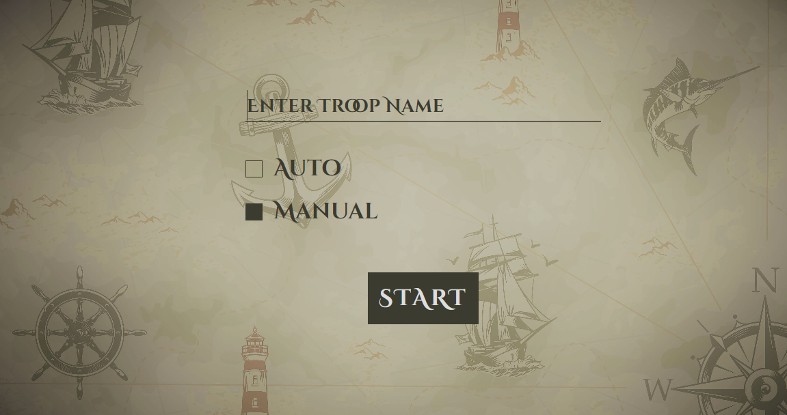
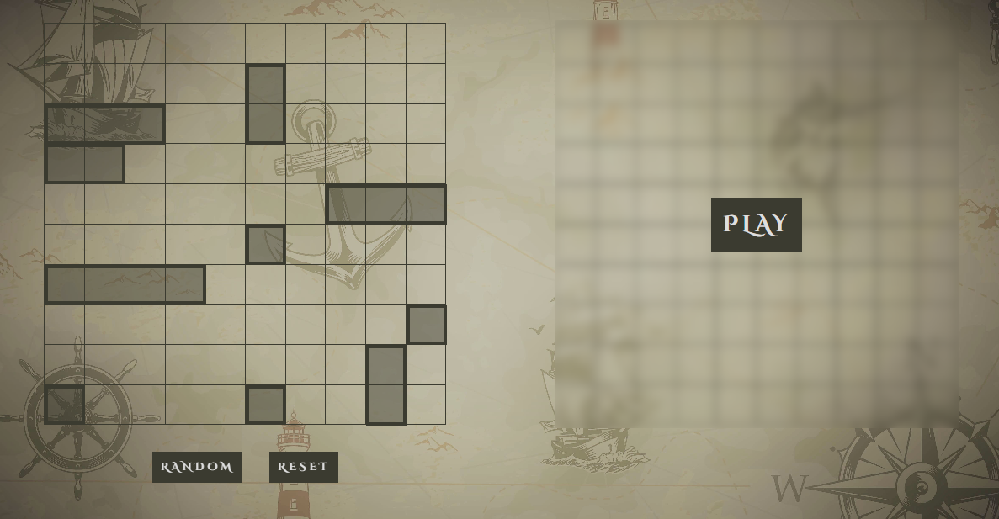
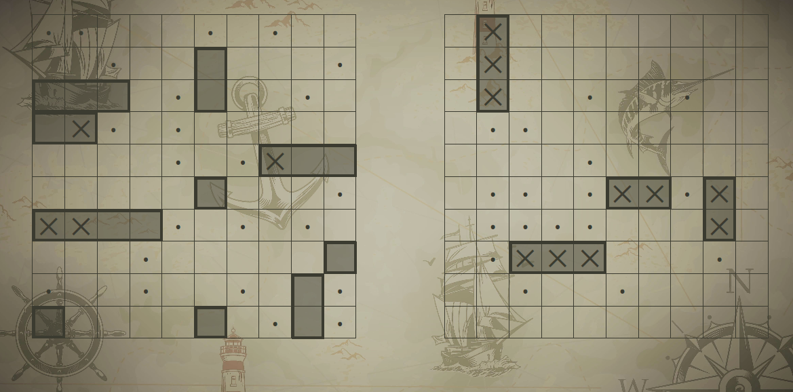

# Battleship

The classic Battleship game created using HTML, CSS, JavaScript along with webpack and jest

## Features

**Two Modes** 

- Manual - default (normal play)
- Auto - sit back and relax! Just enjoy the battle
   

**Random ships placement** 
Sets your board. Keep randomizing as long as you don't like the ships placement. 
\*Note: You can always manually place the ships 

**Vintage UI** 
UI with a vintage vibe 

## Roadmap

- [x] Add sound effects
- [ ] Add background music for 'auto' mode
- [ ] Two player mode (human vs human)
- [ ] Allow player to choose gameboard size

## Learnings

- TDD (unit testing using jest)
- remove() - removes the node from the DOM
- Design first and then start coding
- Webpack revisited
- Relearn ::after and ::before (been a long time hehe)

## Preview

## Demo

👉 [Live Demo](https://ruchita1010.github.io/battleship)
